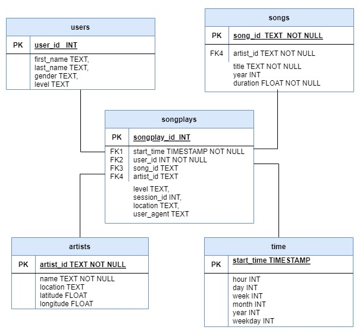

# Project: Data Modeling with Postgres

## Introduction
A startup called **Sparkify** wants to analyze the data they've been collecting on songs and user activity on their new music streaming app. 

The analytics team is particularly interested in understanding what songs users are listening to. Currently, they don't have an easy way to query their data, which resides in a directory of JSON logs on user activity on the app, as well as a directory with JSON metadata on the songs in their app.

As a Data engineer assigned to this project, my role is to create a Postgres database with tables designed to optimize queries on song play analysis.

## Datasets
1. **`Song Dataset`**: The first dataset is a subset of real data from the Million Song Dataset. Each file is in JSON format and contains metadata about a song and the artist of that song. The files are partitioned by the first three letters of each song's track ID. For example, here are file paths to two files in this dataset.   
     >`song_data/A/B/C/TRABCEI128F424C983.json
song_data/A/A/B/TRAABJL12903CDCF1A.json`

    And below is an example of what a single song file, TRAABJL12903CDCF1A.json, looks like.
   > {"num_songs": 1, "artist_id": "ARJIE2Y1187B994AB7", "artist_latitude": null, "artist_longitude": null, "artist_location": "", "artist_name": "Line Renaud", "song_id": "SOUPIRU12A6D4FA1E1", "title": "Der Kleine Dompfaff", "duration": 152.92036, "year": 0}

2. **`Log Dataset`**: The second dataset consists of log files in JSON format generated by this event simulator based on the songs in the dataset above. These simulate activity logs from a music streaming app based on specified configurations. For example, here are filepaths to two files in this dataset.
    > `log_data/2018/11/2018-11-12-events.json
log_data/2018/11/2018-11-13-events.json`
    
    And below is an example of what the data in a log file, 2018-11-12-events.json, looks like.
   > {"artist":null,"auth":"Logged In","firstName":"Walter","gender":"M","itemInSession":0,"lastName":"Frye","length":null,"level":"free","location":"San Francisco-Oakland-Hayward, CA","method":"GET","page":"Home","registration":1540919166796.0,"sessionId":38,"song":null,"status":200,"ts":1541105830796,"userAgent":"\"Mozilla\/5.0 (Macintosh; Intel Mac OS X 10_9_4) AppleWebKit\/537.36 (KHTML, like Gecko) Chrome\/36.0.1985.143 Safari\/537.36\"","userId":"39"} 
   

   
   
## Running the python scripts

1. **sql_queries.py**: Contains the queries related to create table, insert data, and drop table.
2. **create_tables.py**: Open the terminal and run `python create_tables.py` command to create the database and tables. This file also drop the tables if they are already present. Thus, resets the database each time create_tables.py is executed.
3. **test.ipynb**: Run test.ipynb in notebook to confirm the creation of your tables with the correct columns. Make sure to click "Restart kernel" to close the connection to the database after running this notebook.
4. **etl.ipynb**: Execute etl.ipynb notebook to develop ETL processes for each table. At the end of each table section, or at the end of the notebook, run test.ipynb to confirm that records were successfully inserted into each table.
5. **etl.py**: Run etl.py on terminal to process the entire datasets.

## Files in the Datasets
1. **data/song_data**: Contains data related to songs. This dataset is used to populate **songs** and **artists** tables.
2. **data/log_data**: Contains logs for song plays. This dataset is used to populate **time** and **users** tables. 
**songplays table** take song_id and artist_id from songs and artists tables respectively and remaining columns are populated using log dataset.

## Schema

For analysis, I have created star schema using the song and log datasets. There is fact table (songplays) and 4 dimension tables (users, songs, artists, and time). The schema is defined as per the below diagram.
     

Star Schema will provide better flexibility on queries for song play analysis.

## Example queries for song play analysis
1. Comparison of different types of users: 
> SELECT level, COUNT(user_id) FROM songplays GROUP BY level
2. Location having maximum songplays: 
> SELECT location, COUNT(location) FROM songplays GROUP BY location ORDER BY COUNT(location) DESC LIMIT 1
3. Details of the most active user: 
> SELECT first_name, last_name, gender, u.level, COUNT(s.user_id) FROM songplays s JOIN users u ON s.user_id = u.user_id GROUP BY first_name, last_name, gender, u.level ORDER BY COUNT(s.user_id) DESC LIMIT 1

